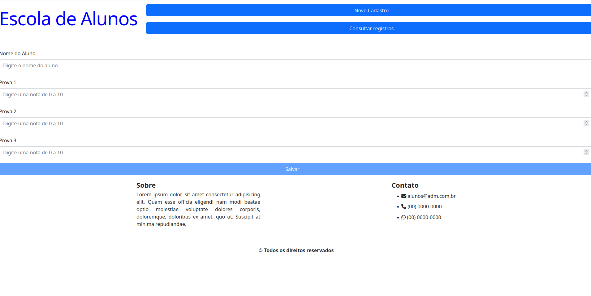
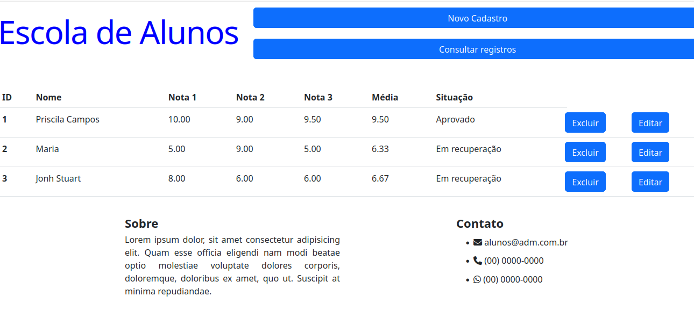

# Student Management


1. [Introduction](#introduction)
2. [Functionality](#functionality)
3. [Technologies Used](#technologies-used)
4. [Usage](#usage)
5. [Contribution](#contribution)
6. [Author](#author)

## Introduction 
This project consists of the frontend side of a scholar website where teachers can register and edit information about students, including their grades.

## Functionality

* On the initial page, it is possible to choose between registering a new student or checking the current registers.

<div align="center" justify-content='space-around'>
  
</div>

* To register a new student, it is necessary to provide a name and 3 test grades. All fields are necessary.

<div align="center" justify-content='space-around'>
  
</div>

* After registration, all students will be shown on the "Cadastros" page, with their notes and school situations.

<div align="center" justify-content='space-around'>
  
</div>

## Technologies Used

* IDE: Visual Studio Code
* Angular
* HTML
* CSS
* TypeScript
* Github
* Github Pages

## Usage

You can interact with the project on [Github Pages](https://pris-c.github.io/student-management/).

If you'd like to utilize the project locally, follow these steps:

1. **Install NodeJS**
    - [Download and install NodeJS](https://nodejs.org/en/).

2. **Install Angular version 14**
    - You can use the following command in your terminal:
        ```bash
        npm i -g @angular/cli@14
        ```

3.  **Clone the Repository:**
    - Clone the project repository using your preferred IDE or the following command:
      ```bash
      git clone https://github.com/Pris-c/student-management.git
      ```

4. **Import into IDE:**
    - Open the project in your favorite IDE (e.g., VSCode, IntelliJ, Eclipse).
    <br> 

5. **Run the Application**
    - Initialize the server by running one of the following commands at the root folder:
     ```bash
      ng serve
      ```
      ```bash
      npm start
      ```

6. **Access the project locally**
    - Now, you can access the Student Management on your local service at
    ```bash
    http://localhost:4200
    ```

## Contribution

Contributions are welcome! Feel free to open issues to report bugs or propose enhancements. If you'd like to contribute directly, open a pull request.
<br>

## Author

Priscila Campos: 
👩🏾‍💻  [@Pris-c](https://github.com/Pris-c)
